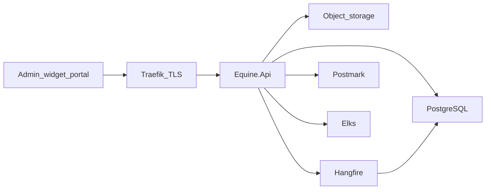

# Architecture overview

HästJournal is a **modular monolith**: one ASP.NET Core API, one PostgreSQL database, one Docker image that also serves the Angular admin, widget, and portal. Multiple practices share the database and are isolated by `TenantId` (see [ADR-0009](adr/0009-multi-tenancy.md)). Practices self-register; the platform is free until Stripe subscriptions are added.

## Layers

| Project | Role |
|---|---|
| `Equine.Domain` | Entities and rules. No EF, no ASP.NET. |
| `Equine.Infrastructure` | DbContext, storage, email/SMS, import, archive export, PDF |
| `Equine.Api` | Minimal APIs, auth, middleware |
| `Equine.Jobs` | Hangfire recurring work |
| `tools/Equine.Import` | CSV historic import (CLI, not HTTP) |
| `web/apps/admin` | Practitioner app (`sv-SE`) |
| `web/apps/widget` | Public booking iframe |
| `web/apps/portal` | Client magic-link portal |

## Security boundary

- `/api/public/{slug}/*` — anonymous, rate-limited, no owner/horse names on slot queries; slug selects the practice
- `/api/app/*` — JWT with `tenantId`, role policies

See [ADR index](adr/README.md). Hosting: Linux VPS, Dokploy, Traefik (Let’s Encrypt). Backups: [runbooks/backup.md](runbooks/backup.md).
